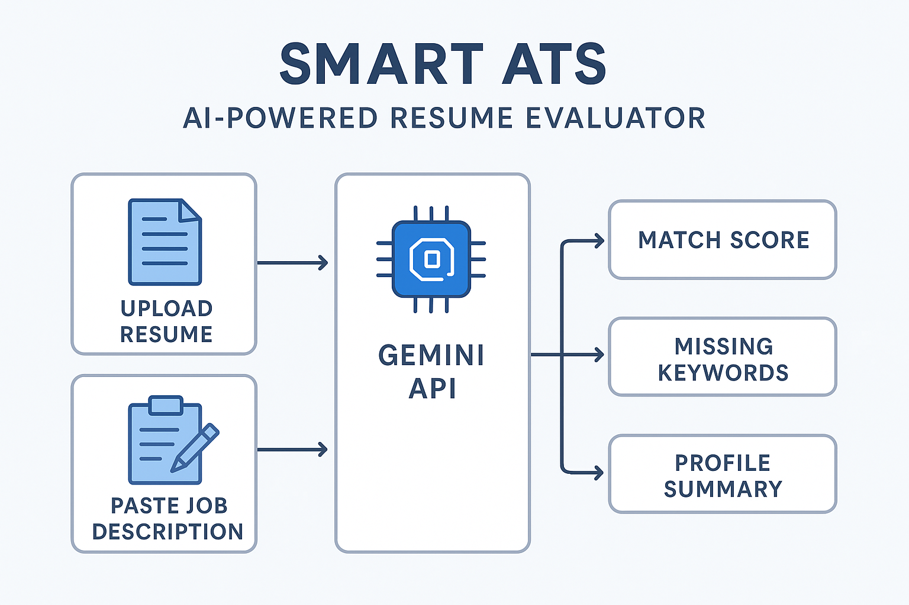

# Smart ATS - AI-Powered Resume Evaluator using Streamlit and Gemini

---

[Demo video](https://drive.google.com/file/d/13tnLbMaOTvTcoPlUVuVZjj0coagoYbus/view?usp=sharing)




## Problem Statement

In today's competitive job market, resumes are often screened by Applicant Tracking Systems (ATS) before reaching a human recruiter. Many qualified candidates get filtered out due to a lack of keyword alignment with job descriptions.

**Objective:**  
Build an intelligent tool that analyzes a resume and evaluates how well it matches a given job description using a generative AI model.

---

## Industry Context

Recruiters receive hundreds of applications for a single role. ATS platforms use keyword matching and rule-based filters to shortlist resumes. However, these systems are often rigid and miss context or nuances.

This project mimics an advanced AI-based ATS that can:
- Understand context from both resumes and job descriptions
- Generate helpful feedback for job seekers
- Provide matching scores and missing keyword suggestions

---

## Solution Overview

The app uses:

- **Streamlit** for building a user-friendly interface
- **Google (google AI studio API)** for evaluating resumes against job descriptions
- **PyPDF2** to read uploaded resumes in PDF format
- **dotenv** for securely managing API keys

**Workflow:**

1. User uploads a resume (PDF)
2. User pastes a job description
3. Gemini analyzes both and generates:
   - Match percentage
   - Missing keywords
   - Profile summary and suggestions

---

## Results

Example output:

```json
{
  "JD Mtch": "84%",
  "MissingKeywords": ["Docker", "CI/CD", "Kubernetes"],
  "Profile Summary": "Strong data science background. Add DevOps tools to better match the JD."
}
